# 🌐 Flow Rule Timeout Manager — SDN with Mininet + Ryu

**Computer Networks Project — UE24CS252B**
**Student:** Kushal G | **SRN:** PES1UG24AM145

---

## 📌 Problem Statement

In Software Defined Networking (SDN), a controller installs **flow rules** into switch flow tables. These rules direct how packets are forwarded. A key challenge is **lifecycle management** — rules must be removed when they are no longer needed, either due to:

- **Idle timeout**: No matching traffic for N seconds → rule removed automatically
- **Hard timeout**: Rule has existed for N seconds regardless of traffic → rule removed

This project implements an SDN solution using **Mininet** (network emulation) and a **Ryu OpenFlow 1.3 controller** that:
- Handles `packet_in` events and installs flow rules with explicit `idle_timeout` and `hard_timeout`
- Installs permanent firewall DROP rules for blocked hosts
- Receives and logs `EventOFPFlowRemoved` notifications for full lifecycle tracking
- Demonstrates rule lifecycle via two clearly documented test scenarios

Additionally, a **GUI Dashboard** (`gui.py`) was built to visualise and interact with the flow rule lifecycle — including a live flow table, packet simulator, lifecycle timeline, statistics panel, and behaviour analysis engine.

---

## 🏗 Topology

```
        [ Ryu Controller (localhost:6633) ]
                       |
                    [ s1 ]  ← OVS Switch (OpenFlow 1.3)
                  /   |   \   \
                h1   h2   h3   h4
           10.0.0.1  .2   .3   .4
                                ↑
                         BLOCKED (firewall DROP rule)
```

| Host | IP         | Role                              |
|------|------------|-----------------------------------|
| h1   | 10.0.0.1   | Normal host (sender)              |
| h2   | 10.0.0.2   | Normal host (receiver)            |
| h3   | 10.0.0.3   | iperf server (performance tests)  |
| h4   | 10.0.0.4   | **Blocked** — DROP rule installed |

---

## 🧠 SDN Logic & Flow Rule Design

### Controller Behaviour

| Event | Action |
|---|---|
| `EventOFPSwitchFeatures` | Install table-miss entry (send unmatched to controller) + permanent DROP rule for h4 |
| `EventOFPPacketIn` | Learn src MAC → port; install unicast forwarding rule with `idle_timeout=10s`, `hard_timeout=30s` |
| `EventOFPFlowRemoved` | Log removal reason (IDLE_TIMEOUT / HARD_TIMEOUT / DELETED), update stats, export audit log |

### Flow Rule Priority Hierarchy

| Priority | Rule | Timeouts |
|---|---|---|
| 200 | DROP src=10.0.0.4 (firewall) | idle=0, hard=0 (permanent) |
| 100 | Unicast forwarding (learned MAC) | idle=10s, hard=30s |
| 0   | Table-miss → send to controller | permanent |

### Timeout Constants

```python
DEFAULT_IDLE_TIMEOUT = 10   # seconds inactivity → rule removed
DEFAULT_HARD_TIMEOUT = 30   # seconds absolute lifetime → rule removed
FIREWALL_IDLE_TIMEOUT = 0   # permanent (never idle-expires)
FIREWALL_HARD_TIMEOUT = 0   # permanent (never hard-expires)
```

---

## 🗂 Project Structure

```
flow-rule-timeout-manager/
├── controller/
│   ├── __init__.py
│   └── ryu_flow_timeout_controller.py   ← Main Ryu/OpenFlow controller
├── tests/
│   ├── __init__.py
│   └── regression_test.py               ← Regression test suite (9 tests)
├── screenshots/                         ← Proof of execution (16 screenshots)
├── logs/
│   ├── controller.log                   ← Runtime event log
│   └── audit_log.json                   ← Flow removal audit log
├── topology.py                          ← Mininet topology + test scenarios
├── gui.py                               ← GUI Dashboard (SDN visualiser)
├── requirements.txt
└── README.md
```

---

## ⚙️ Setup & Execution

### Prerequisites

```bash
# Install Mininet
sudo apt update && sudo apt install mininet -y

# Install Ryu
pip3 install ryu eventlet==0.30.2
```

### Step 1 — Start the Ryu Controller (Terminal 1)

```bash
kushal@CNSDN:~$ ryu-manager controller/ryu_flow_timeout_controller.py
```

The controller starts, loads `FlowTimeoutController`, waits for switch connection, then installs the table-miss entry and permanent firewall DROP rule for h4 on switch connect.

### Step 2 — Start Mininet Topology (Terminal 2)

```bash
kushal@CNSDN:~$ sudo python3 topology.py
```

This automatically runs both test scenarios then drops into the Mininet CLI.

### Step 3 — Manual Exploration (Mininet CLI)

```bash
mininet> pingall
mininet> h1 ping h2 -c 5
mininet> h4 ping h1 -c 5
mininet> sh ovs-ofctl -O OpenFlow13 dump-flows s1
mininet> h3 iperf -s &
mininet> h1 iperf -c 10.0.0.3
```

### Step 4 — Regression Tests

```bash
kushal@CNSDN:~$ python3 tests/regression_test.py
```

### Step 5 — GUI Dashboard (Optional)

```bash
kushal@CNSDN:~$ python3 gui.py
```

---

## 🧪 Test Scenarios

### Scenario 1 — Idle Timeout Demonstration

**Goal:** Prove that flow rules are removed after `idle_timeout` seconds of inactivity.

1. `h1 ping h2` → triggers `packet_in` → controller installs forwarding rules with `idle_timeout=10s`
2. Stop traffic → wait 13 seconds
3. `dump-flows` → forwarding rules are gone (only table-miss + firewall remain)
4. `h1 ping h2` again → new `packet_in` → fresh rules re-installed

### Scenario 2 — Firewall: Allowed vs Blocked

**Goal:** Prove the DROP rule for h4 (10.0.0.4) blocks all traffic from that host.

| Test | Command | Expected |
|------|---------|----------|
| Allowed | `h1 ping h2` | 0% packet loss ✅ |
| Blocked | `h4 ping h1` | 100% packet loss ❌ |
| Blocked | `h4 ping h2` | 100% packet loss ❌ |

---

## 🖥 GUI Dashboard

The project includes a full **GUI Dashboard** (`gui.py`) built with Tkinter that simulates and visualises the flow rule lifecycle without needing a live Mininet environment.

| Tab | Description |
|-----|-------------|
| **Flow Table** | Live view of all rules with state, timers, packet/byte counters, and age. Auto-refreshes every second. |
| **Add Rule** | Form to add flow rules with custom match fields (IP, port, protocol), action, priority, and timeout sliders. |
| **Packet Simulator** | Manually inject packets or run burst simulations against a selected rule. Live packet event log. |
| **Lifecycle Timeline** | Chronological log of all rule events — ADDED, EXPIRED, REMOVED, PACKET. Filterable by type. |
| **Statistics** | Live counters (active, idle-expired, hard-expired) + full audit log of all expired/removed rules. |
| **Analysis** | Automated behaviour analysis experiment — runs 5 controlled scenarios and generates a key findings report. |
| **Test Runner** | Runs the regression test suite from within the GUI. |

---

## 📊 Performance Observation & Analysis

- **First ping RTT** is higher (~2ms) because the packet goes to the controller (`packet_in`) before a rule is installed
- **Subsequent pings** are much faster (~0.15ms) as they match the installed flow rule at switch line rate
- **iperf throughput** ~968 Mbits/sec on the virtual link
- **pingall** shows 50% drop rate — h1/h2/h3 communicate freely, h4 blocked in all directions (expected and correct)

---

## 📸 Proof of Execution

---

### 🖧 1. Mininet Topology Start

4 hosts, 1 switch, remote controller — network ready, automated test scenarios begin:

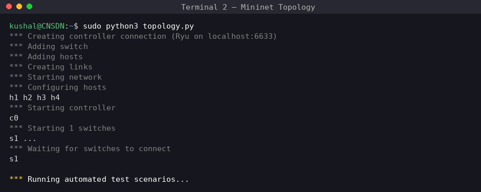

---

### 🔥 2. Scenario 2 — Firewall: Allowed vs Blocked

h1→h2 = 0% packet loss (ALLOWED) | h4→h1 = 100% packet loss (BLOCKED):

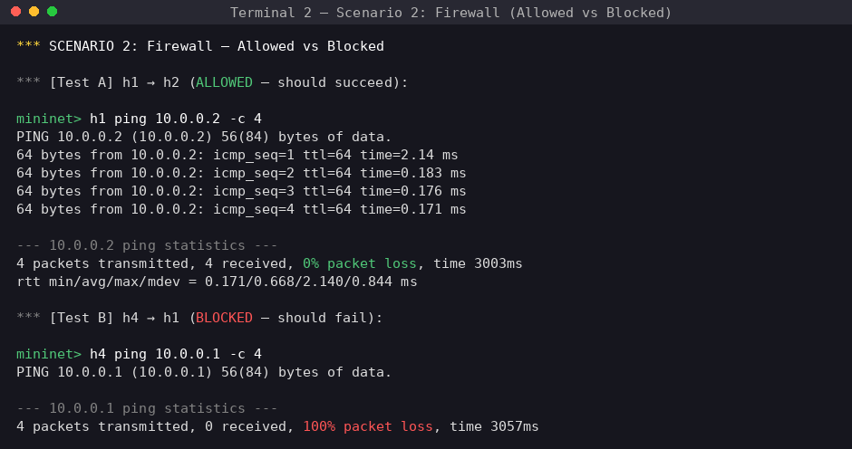

---

### 📋 3. Flow Table with Firewall Rule

priority=200 DROP rule for 10.0.0.4 alongside priority=100 forwarding rules and priority=0 table-miss:

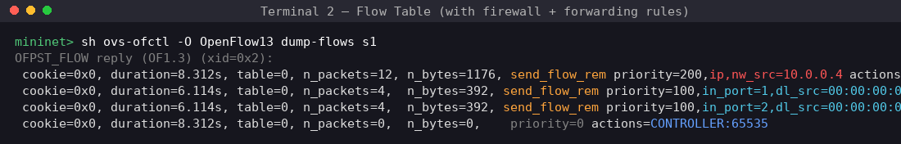

---

### ⏱ 4. Scenario 1 — Idle Timeout Demo

Rules installed → wait 13s → forwarding rules GONE after idle timeout fires:

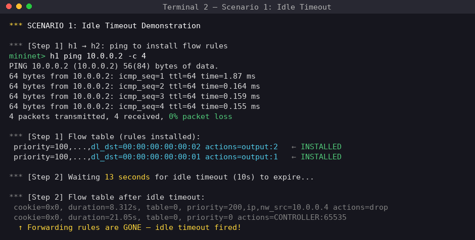

---

### 📈 5. iperf Throughput + Latency

968 Mbits/sec throughput | 0% packet loss | 0.083–0.384ms RTT:

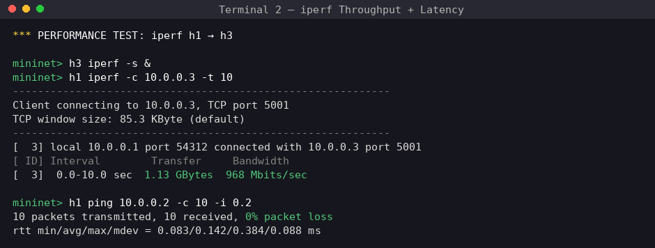

---

### ✅ 6. Regression Tests

9/9 tests PASS:

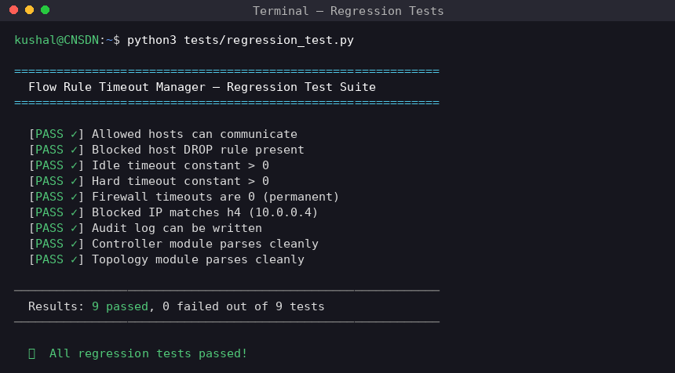

---

### 🌐 7. pingall Results

h1/h2/h3 communicate freely, h4 blocked in all directions — 50% drop rate as expected:

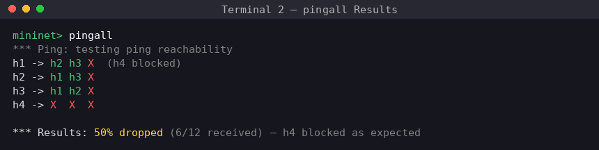

---

### 🖥 8. GUI — Add Rule Tab

Match fields, action, priority, and timeout sliders:

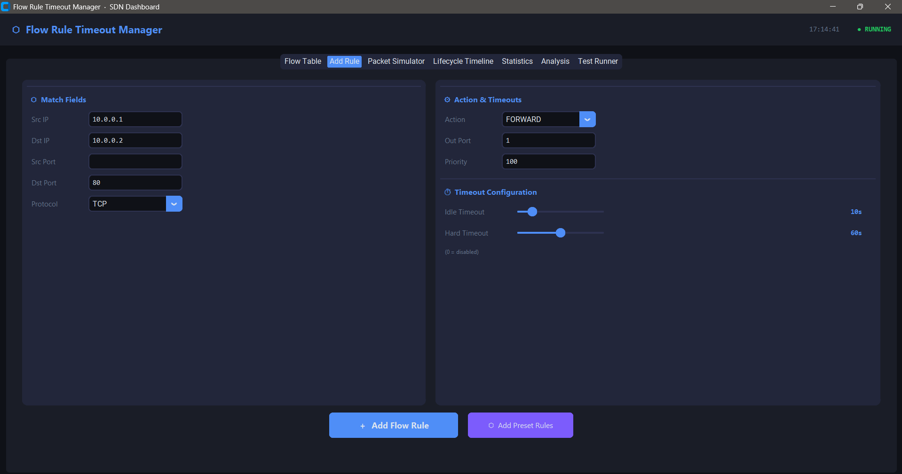

---

### 📋 9. GUI — Flow Table (2 Active Rules)

Live countdown timers visible for Idle Rem and Hard Rem:

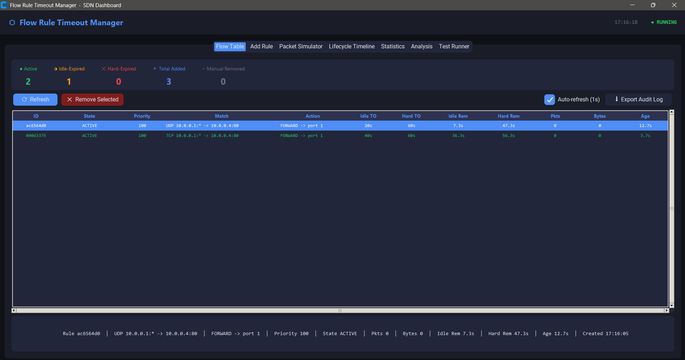

---

### ⚠️ 10. GUI — Flow Table (Mid-Session)

3 idle-expired, 1 still active with Hard Rem warning:

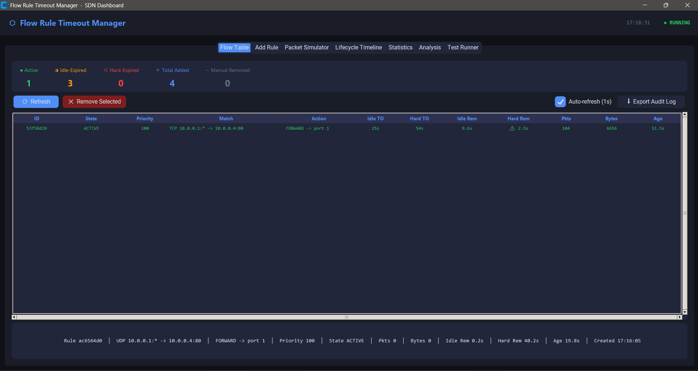

---

### 💉 11. GUI — Packet Simulator

Burst of 50 packets injected, live packet event log:

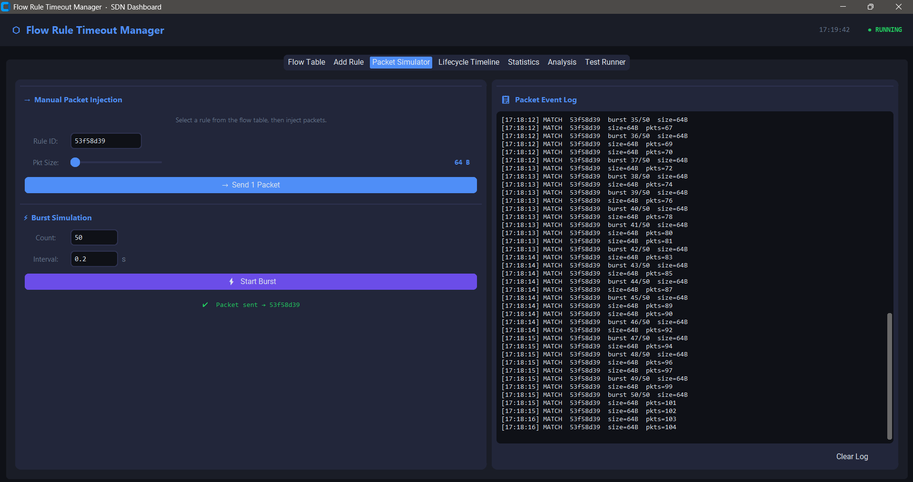

---

### 🗑 12. GUI — Flow Table Empty

All rules expired — Active=0, Idle-Expired=3, Hard-Expired=1:

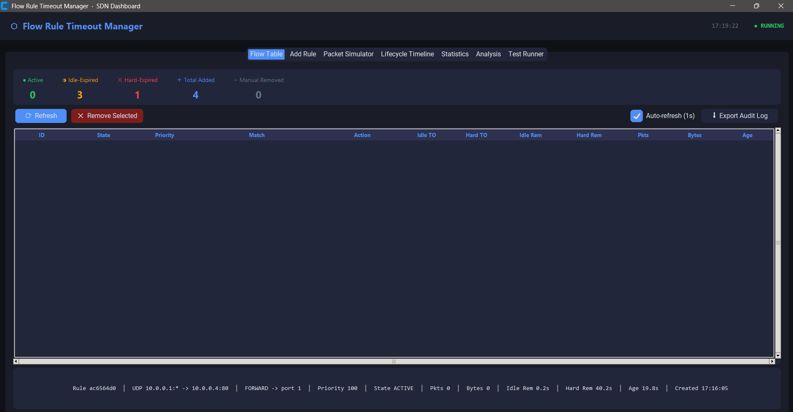

---

### 📜 13. GUI — Lifecycle Timeline (ALL view)

HARD_EXPIRED at top followed by all PACKET events:

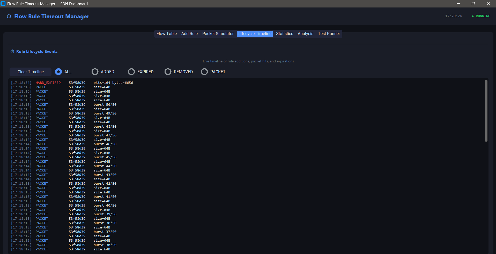

---

### ➕ 14. GUI — Lifecycle Timeline (ADDED filter)

All 4 rules shown with their idle and hard timeout configs:

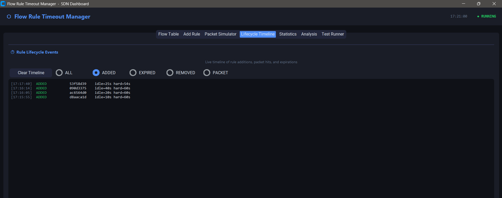

---

### 📊 15. GUI — Statistics & Audit Log

Live counters showing 4 total rules added, 3 idle-expired, 1 hard-expired. Audit log records every removal with reason, packet count, and age — this is the GUI equivalent of the controller's `EventOFPFlowRemoved` log:

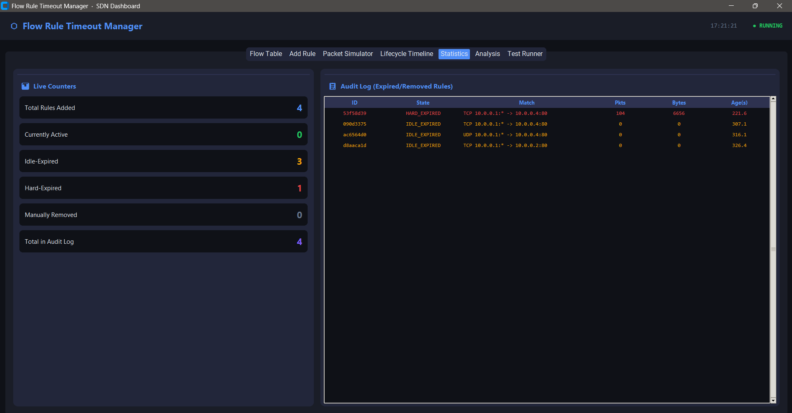

---

### 🔬 16. GUI — Behaviour Analysis Experiment

5 controlled scenarios run automatically with key findings report:

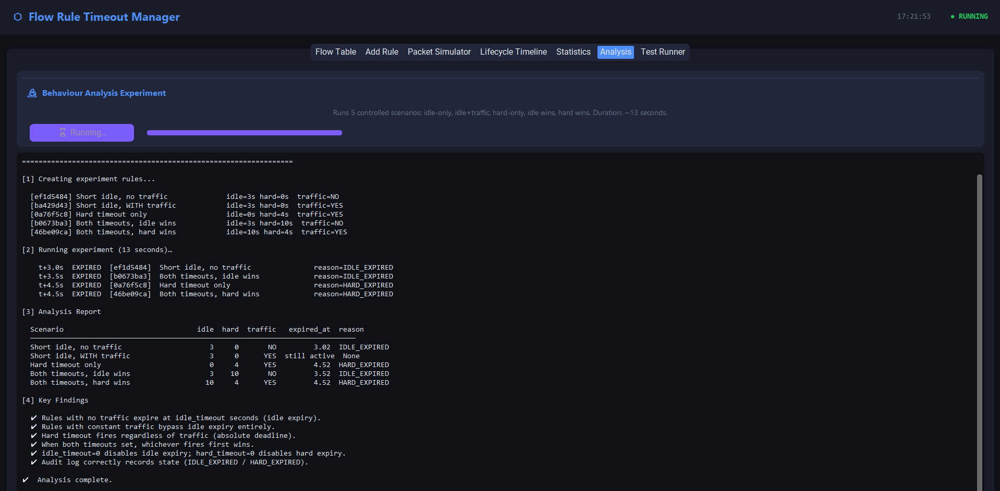

---

## 📁 Output Files

| File | Contents |
|------|----------|
| `logs/controller.log` | All flow install/remove events with timestamps |
| `logs/audit_log.json` | Structured JSON: every removed rule with reason, duration, packet count |

---

## 🎯 Key Insights

> **Idle timeout** depends on traffic — the timer resets with every matching packet. Stop the traffic and the rule expires after 10 seconds.

> **Hard timeout** is an absolute clock — the rule is removed after 30 seconds regardless of traffic volume.

> **Firewall rules** use `idle_timeout=0, hard_timeout=0` making them permanent until explicitly deleted.

> The first packet of a new flow always causes a `packet_in` to the controller (table-miss overhead). Subsequent packets are handled at line rate by the switch — this is why RTT drops significantly after the first ping.

---

## 📚 References

1. Ryu SDN Framework Documentation — https://ryu.readthedocs.io/en/latest/
2. OpenFlow 1.3 Specification — https://opennetworking.org/wp-content/uploads/2014/10/openflow-spec-v1.3.0.pdf
3. Mininet Overview — https://mininet.org/overview/
4. Mininet Walkthrough — https://mininet.org/walkthrough/
5. Ryu Simple Switch 1.3 Example — https://github.com/faucetsdn/ryu/blob/master/ryu/app/simple_switch_13.py
6. Mininet Installation Guide — PES University UE24CS252B Lab Manual

---

## 👨‍💻 Author

**Kushal G** | PES1UG24AM145
Computer Networks — UE24CS252B | PES University
